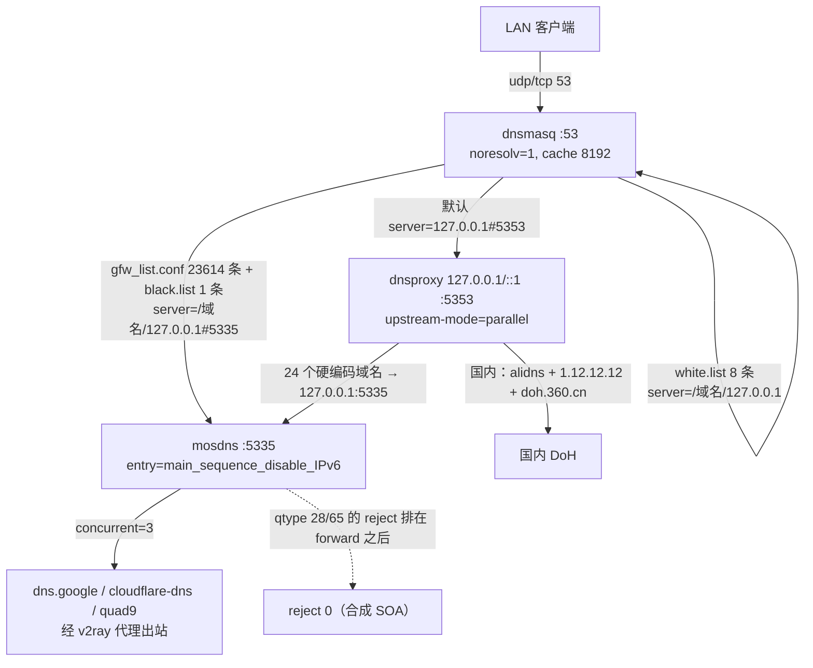
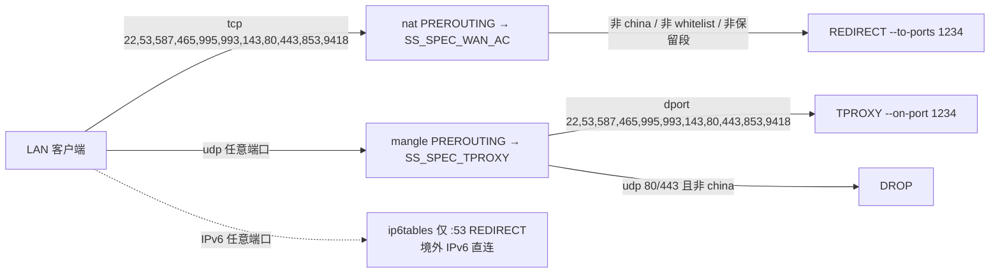

# 192.168.3.254 全链路配置审计报告

- 审计日期：2026-10-09
- 审计对象：在线路由器 `192.168.3.254`（OpenWrt 24.10.5 / LEDE R26.05.20 / x86_64 / kernel 6.12.107）；仓库 `youridol/openwrt-build` @ `c36c654`
- 采集窗口：2026-10-09 01:03–01:41（Asia/Shanghai）
- 审计方式：**全程只读**。未执行 `uci set/delete/commit`、未重启任何服务、未写路由器任何文件、未改 `iptables/ip6tables/ipset`、未 `opkg install/remove`、未 `modprobe`、未 `reboot`、未安装任何软件。
- 连接通道：`plink.exe`（PuTTY）固定 hostkey；路由器侧命令经 base64 传入 `sh` 执行。本机侧基线在 Windows `192.168.3.238` 采集。
- 证据级别：每条结论附命令与原始输出。凡无实测证据的推断，均在文中显式标注「未证实」。

---

## 1. 环境快照

| 项 | 值 |
|---|---|
| 发行版 | `OpenWrt 24.10.5`，`DISTRIB_REVISION='R26.05.20'`，`DISTRIB_TARGET='x86/64'`，`DISTRIB_DESCRIPTION='LEDE '` |
| 内核 | `Linux LEDE 6.12.107 #0 SMP Tue Sep 1 17:23:52 2026 x86_64` |
| CPU | `Intel(R) Celeron(R) CPU N2930 @ 1.83GHz`，4 核，当前 2166.790 MHz |
| WAN | `pppoe-wan`，IPv4 `100.119.127.84 peer 100.119.0.1/32`（100.64/10 段），MTU 1492，IPv6 `240e:350:7e0a:2eab:4cc7:fa5c:8eb4:282/64` |
| LAN | `br-lan` = `eth0`，`192.168.3.254/24`，MTU 1500，IPv6 `240e:355:7f6b:d300::1/64`（PD /56 → /64） |
| 签约带宽 | 下行 1000 Mbps / 上行 50 Mbps（用户提供） |
| 代理插件 | ShadowSocksR Plus+，运行态核心 `v2ray`（`xray-core 26.6.1-1`）dokodemo-door `:1234` retcp |
| 节点 | 68 条（52 × vless，16 × hysteria2），`global_server='cfg0a4a8f'` |
| DNS 组件 | `dnsmasq-full 2.91-1`、`dnsproxy 0.83.0-1`、`mosdns 5.3.4-1`、`chinadns-ng 2025.06.20-1`（未在链路中） |
| 内核调优组件 | `kmod-tcp-bbr 6.12.107-1`、`turboacc`（`S90turboacc`）、`packet_steering`（`network.globals.packet_steering='1'`） |
| 共享服务 | `vsftpd 3.0.5-7`、`ksmbd-server 3.5.2-1`、`autosamba 1-15`、`luci-app-vsftpd`、`luci-app-ksmbd`、`miniupnpd-iptables`、`wsdd2` |
| 无 SQM | `tc` 不存在（`ls /sbin/tc /usr/sbin/tc` 均 No such file）；`/lib/modules` 226 个模块无 `sch_cake.ko`/`ifb.ko`/`sch_htb.ko`/`cls_fw.ko`；无 `/etc/config/sqm` |

---

## 2. 运行时数据流

### 2.1 DNS 链路（四跳）



关键实测原文：

- `/var/etc/dnsmasq.conf.cfg01411c`（40 行）：`no-resolv`、`cache-size=8192`、`edns-packet-max=1232`、`server=127.0.0.1#5353`、`conf-dir=/tmp/dnsmasq.d`。
- include 链是通的：`/tmp/dnsmasq.d/dnsmasq-ssrplus.conf` 内容为 `conf-dir=/tmp/dnsmasq.d/dnsmasq-ssrplus.d`，把子目录二次展开（`conf-dir` 非递归，靠这一层补齐）。
- `/tmp/dnsmasq.d/dnsmasq-ssrplus.d/gfw_list.conf`：23614 行，**全部是 `server=/域名/127.0.0.1#5335`，`ipset=` 计数为 0**；而源文件 `/etc/ssrplus/gfw_list.conf` 为 47228 行（server 与 ipset 各 23614），即在 `run_mode='router'` 下 ipset 行被 init 脚本剥离（`ipset list gfwlist` → 该集合不存在）。
- `blacklist_forward.conf`：
  ```
  server=/chatgpt.com/127.0.0.1#5335
  ipset=/chatgpt.com/blacklist
  ```
- `whitelist_forward.conf`：8 个域名，形如 `server=/bilibili.com/127.0.0.1` + `ipset=/bilibili.com/whitelist`。
- `applechina.conf`：173 行 `server=` 且 **不含 `#5335`**（目标地址待复核，见 §5 待证实项 T1）。
- dnsproxy 真实 argv（`/proc/15997/cmdline`）含：`--listen 127.0.0.1 --listen ::1 --port 5353 --bootstrap 223.5.5.5 --bootstrap 223.6.6.6 --fallback https://1.12.12.12/dns-query --upstream https://dns.alidns.com/dns-query --upstream https://1.12.12.12/dns-query --upstream https://doh.360.cn/dns-query --upstream [/google.com/…/herokuapp.com/]127.0.0.1:5335 --timeout 10s --upstream-mode parallel --cache --cache-optimistic --cache-size 8192 --cache-min-ttl 60 --cache-max-ttl 86400`。
  - 该 24 域名列表中**不含 `chatgpt.com`**，`chatgpt.com` 只通过 `blacklist_forward.conf` 进 mosdns。
- `/var/etc/ssrplus/mosdns-config.yaml`（运行时，1120 B）：
  ```yaml
  - tag: forward_google
    args:
      concurrent: 3
      upstreams: [https://dns.google/dns-query, https://cloudflare-dns.com/dns-query, https://dns.quad9.net/dns-query]
  - tag: main_sequence_disable_IPv6
    args:
      - exec: $lazy_cache
      - exec: prefer_ipv4
      - exec: $forward_google
      - matches:
          - qtype 28 65
        exec: reject 0
  ```
- 源模板 `/etc/ssrplus/mosdns-config.yaml`（826 B）用占位符 `DNS_MODE` / `DNS_PORT`，`concurrent: 2`，`upstreams:` 为空 → 运行时由 init 脚本替换（待证实项 T2 复核替换方）。

### 2.2 代理链路（IPv4 有、IPv6 无）



实测原文要点：

- `iptables -t nat -S SS_SPEC_WAN_FW` 末行：`-A SS_SPEC_WAN_FW -p tcp -m multiport --dports 22,53,587,465,995,993,143,80,443,853,9418 -j REDIRECT --to-ports 1234`
- `SS_SPEC_WAN_AC` 判定序：`whitelist` → RETURN；`blacklist` → 强制代理；`bplan` → RETURN；`fplan` → 代理；`127.0.0.0/8:53` → RETURN；`mark 0xff` → RETURN；`ss_spec_wan_ac` → RETURN；`china` → RETURN；末行兜底 → 代理。
- mangle `SS_SPEC_TPROXY`：`RETURN` 保留段（0/8、10/8、127/8、169.254/16、172.16/12、192.168/16、224/4、240/4、53）、`bplan` RETURN、`china` RETURN、`udp 80/443` 无条件 `DROP`（位于 `china`RETURN 之后，故国内 QUIC 已被放行）、末行 TPROXY。
- `ip6tables -t nat -S` 仅两条：`-A PREROUTING -i br-lan -p udp --dport 53 -j REDIRECT --to-ports 53` 与 tcp 对应项；`ip6tables -S | grep -c 1234` = **0**。
- `ipset list`：`china / gmlan / ss_spec_wan_ac / fplan / bplan / whitelist(910) / blacklist(11) / ss_spec_lan_ac`；`blacklist` 成员 = `chatgpt.com` 解析结果 + `@access_control.wan_fw_ips`（Telegram 段、`8.8.8.8`、`1.1.1.1`）。
- `SS_SPEC_WAN_AC` 的 IPv4 REDIRECT 同时挂在 `OUTPUT`：`-A OUTPUT -p tcp -m comment --comment _SS_SPEC_RULE_ -j SS_SPEC_WAN_AC` → **路由器自身发起的 TCP 也会被接管**（dnsproxy 查国外 DoH 走此路）。
- `/etc/firewall.user` 内的 DNS 拦截段（fw3 兼容写法）：
  ```
  iptables  -t nat -A prerouting_rule -i br-lan -p udp --dport 53 -j REDIRECT --to-ports 53
  iptables  -t nat -A prerouting_rule -i br-lan -p tcp --dport 53 -j REDIRECT --to-ports 53
  ip6tables -t nat -A PREROUTING    -i br-lan -p udp --dport 53 -j REDIRECT --to-ports 53
  ip6tables -t nat -A PREROUTING    -i br-lan -p tcp --dport 53 -j REDIRECT --to-ports 53
  ```
  且 `iptables -t nat -S PREROUTING` 中 `SS_SPEC` 在 `prerouting_rule` **之前**。

### 2.3 防火墙与内核旋钮

- `firewall.defaults`：`fullcone='1'`、`flow_offloading='1'`、`flow_offloading_hw='0'`、`drop_invalid='1'`、`forward='REJECT'`；`zone lan` 全 ACCEPT；`zone wan` 网络 `wan wan6`，`input='REJECT'`。
- `turboacc.config`：`set='0'`、`tcpcca='cubic'`、`fastpath='flow_offloading'`、`fastpath_fo_hw='0'`、`fullcone='1'`。
- 启动顺序：`K10turboacc`、`K15shadowsocksr`、`S11sysctl`、`S19dnsmasq`、`S90turboacc`、`S95shadowsocksr`。
- `sysctl` 运行值：`net.ipv4.tcp_congestion_control = cubic`、`net.ipv4.tcp_available_congestion_control = reno cubic bbr`、`net.core.default_qdisc = fq_codel`、`nf_conntrack_max = 131072`、`nf_conntrack_count = 236`、`rps_sock_flow_entries = 16384`。
- RPS 运行值：`eth0/rx-0/rps_cpus = 1`、`eth1/rx-0/rps_cpus = 4`、`br-lan/… = 0`、`pppoe-wan/… = 0`；所有 `rps_flow_cnt = 0`。
- 网卡特性：`eth1` 的 `tso/gso/gro` 均 on，`rx-udp-gro-forwarding: off`；`pppoe-wan` 的 `tx-checksumming: off`、`tcp-segmentation-offload: off`、`gso/gro` on；`eth1` 计数 `tx_errors: 4`、`rx_errors/rx_missed: 0`。
- `pppoe-wan`：`mtu 1492 qlen 3`、`qdisc noqueue`；`eth0/eth1`：`qdisc mq`、`qlen 100`（rc.local 设置）。

### 2.4 对外监听

```
tcp 0.0.0.0:22   dropbear        tcp 0.0.0.0:80/443   uhttpd
tcp 0.0.0.0:21   vsftpd          tcp :::445            （未报 PID）
tcp 0.0.0.0:3702/5355  wsdd2     udp :::123           ntpd
udp 0.0.0.0:67   dnsmasq         tcp/udp 127.0.0.1:5353  dnsproxy
tcp/udp :::5335  mosdns          tcp/udp :::1234        v2ray
```

`vsftpd` 配置 `/etc/config/vsftpd`：`option disabled '0'`。已装 `ksmbd-server` + `luci-app-ksmbd` + `autosamba`。`miniupnpd` 通过 `firewall` 的 `config include 'miniupnpd'` 注入。

---

## 3. 改动前实测基线（2026-10-09 01:25–01:41）

### 3.1 空载 RTT 与抖动（各 30 包）

| 目标 | min | avg | max | sd(pop) | 丢包 |
|---|---|---|---|---|---|
| 192.168.3.254（网关） | 0 | 0 | 0 | 0 | 0/30 |
| 223.5.5.5（阿里 DNS，直连） | 18 | 18.067 | 19 | 0.249 | 0/30 |
| 119.29.29.29（腾讯 DNS，直连） | 19 | 19.000 | 19 | 0 | 0/30 |
| 1.1.1.1（经代理） | 116 | 201.429 | 240 | 33.370 | 2/30 (6.7%) |
| 8.8.8.8（经代理） | — | — | — | — | 30/30 (100%) |

`8.8.8.8` 全丢包是**设计结果**：它在 `wan_fw_ips`/`blacklist` 中，ICMP 被接管后无回程。不可当作网络故障。

### 3.2 DNS 解析耗时（客户端 `192.168.3.254`）

| 域名/类型 | 冷（ms） | 热 min / avg / max（ms） |
|---|---|---|
| baidu.com A | 148.79 | 0.95 / 1.15 / 1.84 |
| qq.com A | 33.20 | 0.92 / 1.08 / 1.20 |
| taobao.com A | 33.37 | 0.73 / 0.89 / 1.05 |
| google.com A | 79.37 | 0.63 / 1.23 / 5.83 |
| google.com AAAA | 14.79（SOA） | 0.62 / 0.73 / 0.82 |
| chatgpt.com A | 83.05 | 0.69 / 0.77 / 0.92 |
| chatgpt.com AAAA | 11.72（SOA） | 0.56 / 0.71 / 0.86 |
| store.steampowered.com A | 73.89 | 0.72 / 7.08 / **63.34** |
| steamcommunity.com AAAA | 11.74（SOA） | 0.57 / 0.72 / 0.83 |

### 3.3 下行饱和时的队列时延（bufferbloat）

| 组 | n | min | avg | max | sd(pop) | 丢包 |
|---|---|---|---|---|---|---|
| 空载（ping 223.5.5.5） | 15 | 18 | 18.067 | 19 | 0.249 | 0 |
| 受压（并行饱和下载） | 15 | 18 | 19.933 | 29 | 3.214 | 0 |

抬升：均值 **+1.87 ms**、峰值 **+10 ms**、标准差 **0.249 → 3.214（×12.9）**，两组均 0 丢包。
饱和下载量：`910,180,011 B / 14.999 s` = `60,682,700 B/s` ≈ **485 Mbps**（HTTP 200，TUNA `ubuntu-24.04.4-desktop-amd64.iso`），约为 1000 Mbps 签约值的 49%。单次样本，未重复测量。

### 3.4 上行吞吐

**测不到**：本机无 `speedtest`/`iperf3`/`librespeed-cli`；`curl` 对 GET 的 `size_upload` 恒为 0；对 TUNA/USTC 发 PUT 均返回 `405 Method Not Allowed`。本报告不含上行吞吐数值。

### 3.5 三条基线事实（避免误读）

1. **AAAA 拒绝是按域名的，不是全局的。** `taobao.com` 返回 8 条真实 AAAA；`google.com`/`chatgpt.com`/`steamcommunity.com`/`cloudflare.com`/`github.com` 返回 mosdns 合成 SOA（`fake-ns.mosdns.fake.root`）；`baidu.com`/`qq.com` 的 SOA 来自**真实权威**（`dns.baidu.com`/`ns1.qq.com`，TTL 自然递减），是上游确实无 AAAA，不是被抑制。
2. **本机 DNS 已被路由器透明劫持。** 向 `192.0.2.1`（RFC 5737 TEST-NET-1，不可路由）发查询仍被应答（24.95 ms，答案与 `1.1.1.1`/`223.5.5.5` 完全一致）→ 所有目的地址的 53 端口查询都先到路由器。因此「对 1.1.1.1 / 223.5.5.5 的对照查询」不是独立外部参照。
3. **`store.steampowered.com` 的 TTL=1**：热态 10 次中第 3 次 63.34 ms 且 TTL 由 1 跳到 19，是缓存立即过期后回源，不是抖动。

---

## 4. 问题清单

级别：P0 = 影响目标达成；P1 = 明确的隐形缺陷；P2 = 次优或风险；工程 = 仓库与文档漂移。
「拟改」列为待定稿方案，逐项附回滚。

### P0-1 上行 50 Mbps 无任何整形，且固件不具备整形能力

- 现象：`ip link` 显示 `pppoe-wan: mtu 1492 qdisc noqueue qlen 3`；`tc` 不存在；无 `sch_cake.ko`/`ifb.ko`；无 `/etc/config/sqm`；`opkg list-installed` 无任何 `sqm*`/`qos*`。
- 证据：`which tc` 无输出；`ls /sbin/tc /usr/sbin/tc` → No such file；`find /lib/modules -name 'sch_cake*'…` 空；`opkg list-installed | grep -Ei 'sqm|qos'` 空。
- 根因：固件从未编入 SQM 相关包；上行 50 Mbps 是全链路最窄的瓶颈，其排队完全依赖 `eth1` 的 `mq` 默认队列。
- 影响：上行饱和时（备份、上传、Steam 上传、会议）会出现排队时延抬升，直接体现为游戏 ping 抖动。注意：**下行侧实测抖动很轻微**（§3.3），本项的预期收益主要在上行。
- 拟改：固件内编入 `sqm-scripts` + `kmod-sched-cake` + `kmod-ifb` + `luci-app-sqm`；首开机默认写入 `/etc/config/sqm`：上下行均用 cake，上行按 50 Mbps 的 90%（≈45 Mbit），下行取保守值 900 Mbit，`linklayer='ethernet'`、`overhead='34'`、`tcMPU='68'`（OpenWrt wiki 的 PPPoE/VDSL 组合；cake 的 `ethernet` 关键字等价 38/84，两者相差 4 字节/包，对 50 Mbps 整形精度影响可忽略）。WAN 侧用 `nat dual-srchost`（egress）与 `ingress nat dual-dsthost`（ingress）；LAN 口不加 `nat`，否则 Per-Host Isolation 失效。
- 回滚：`uci delete sqm.@queue[0]; uci commit sqm; /etc/init.d/sqm stop; /etc/init.d/sqm disable`（或直接刷回上一版固件）。

### P0-2 BBR 声明未生效，运行时为 cubic

- 现象：`sysctl net.ipv4.tcp_congestion_control` → `cubic`；而 `/etc/sysctl.conf` 与 `/etc/sysctl.d/12-tcp-bbr.conf` 均写 `bbr`，`tcp_bbr` 已加载（`lsmod` 引用计数 7），`bbr` 在 `tcp_available_congestion_control` 列表中。
- 根因（已定位）：`/etc/init.d/turboacc` 第 143–145 行
  ```
  config_get "tcpcca" "config" "tcpcca" "cubic"
  sysctl -w net.ipv4.tcp_congestion_control="$tcpcca"
  ```
  而 `turboacc.config.tcpcca='cubic'`；`turboacc` 以 `S90` 启动，晚于 `S11sysctl`，开机后被覆盖。
- 影响：**作用域仅限路由器自身发起的 TCP** —— dnsproxy 的 DoH 出站、v2ray 隧道、`ssrplusupdate.sh`、opkg。它**不影响** LAN 客户端转发的 TCP（拥塞控制由两端各自协商）。`/etc/sysctl.conf` 中「Gaming Network Optimization」的注释把它写成对游戏的作用，属过度声明。
- 拟改：`turboacc.config.tcpcca='bbr'`（首开机默认 + 仓库 overlay 联动），保留 `sysctl.conf` 的 bbr 声明。
- 回滚：`uci set turboacc.config.tcpcca='cubic'; uci commit turboacc; sysctl -w net.ipv4.tcp_congestion_control=cubic`。

### P1-3 `filter_aaaa` 的仓库值与现网语义相反，且仓库注释已过时

- 现象：路由器在线 `shadowsocksr.@global[0].filter_aaaa='1'`；仓库 `files/etc/uci-defaults/99-gaming-optimize` 第 180 行为 `'0'`。
- 实测语义（走客户端真实路径）：
  - `filter_aaaa=1` → mosdns `entry: main_sequence_disable_IPv6` → 对 `qtype 28/65` `reject 0`。而 `gfw_list.conf` 的 23614 个域名 + `black.list` 的 `chatgpt.com` 全部由 dnsmasq 指向 `127.0.0.1#5335` → **这些域名只剩 IPv4，回落走代理**；`taobao.com` 仍返回真实 AAAA。
  - 即：**拒绝集 = 需走代理的域名集**，这正是本次期望的语义。
- 根因：v0.3.5 把仓库值定为 `'0'` 时，其前提是「dnsmasq 把所有域名都指向 5335」；现在路由是分裂的（默认走 dnsproxy:5353 国内 DoH，gfw_list 走 mosdns:5335），语义完全变了。仓库注释（第 161–179 行）与 AGENTS.md §5 仍按旧前提叙述。
- 影响：若按仓库值刷机，那 23614 个被墙域名将拿到真实 AAAA，客户端改走 IPv6 直连 → 被 RST，表现为「有 IPv6 但打不开站点」。
- 拟改：仓库值由 `'0'` 改为 `'1'`，并同步更正 `99-gaming-optimize` 注释与 AGENTS.md §5；另立 ADR 记录该反直觉结论（见 §7）。
- 回滚：`uci set shadowsocksr.@global[0].filter_aaaa='0'; uci commit shadowsocksr; /etc/init.d/shadowsocksr restart`。
- 注意：该项**在用户环境中已是 `'1'`**，改动只影响仓库与后续刷机的一致性。

### P1-4 mosdns 的 `reject` 排在 `forward` 之后，每个被拒查询都白付一次上游往返

- 现象：`main_sequence_disable_IPv6` 的规则序为 `lazy_cache → prefer_ipv4 → forward_google → (qtype 28 65 → reject 0)`。
- 根因（一手来源 + 源码）：mosdns v5 的 `sequence` 依次执行每条 rule；`ActionReject.Exec` 用 `qCtx.SetResponse(r)` **覆盖**已写入的应答。因此该写法是「先真向上游发出 AAAA/HTTPS 查询，再用空 NOERROR 应答替换」。
- 影响：所有 AAAA/HTTPS 查询（含被拒的）都要经代理出站一次，是 cold 查询耗时（google AAAA 14.79 ms、steamcommunity AAAA 11.74 ms 仍含一次上游往返）与代理侧负载的直接来源。
- 拟改：把 `matches: qtype 28 65 → exec: reject 0` 移到 `$lazy_cache` 之后、`$forward_google` 之前。同时把 `dns.google / cloudflare / quad9` 收敛为 `cloudflare + google`（保留 `concurrent`，去方差最大的 quad9）。
- 回滚：还原 `/etc/ssrplus/mosdns-config.yaml` 模板并 `/etc/init.d/shadowsocksr restart`（仓库侧保留原文件备份）。
- 待证实：T2 —— 模板到运行时配置的替换方（init 脚本 or 插件）需确认后再改，避免改错文件。**注意**：运行时 `/var/etc/ssrplus/mosdns-config.yaml` 的 `concurrent: 3` 与 3 个上游是 init 脚本注入的（源模板为 `concurrent: 2` + 空 `upstreams:`），因此改模板时必须同时确认 `tunnel_forward_mosdns` 的 UCI 值。

### P1-5 撤回：`ssr-switch` 667s 是健康检查间隔，不是定时轮换

- **原判断错误，已撤回。** 审计初稿称「每 667 秒无条件切换节点」，依据仅为 UCI `switch_time='667'` 与进程实参。
- 证据（脚本级）：`/usr/bin/ssr-switch` 是纯 shell 脚本，`start()` 为：
  ```
  start() {
      while [ "1" = "1" ]; do
          sleep "0000$cycle_time"
          run_once
      done
  }
  ```
  init 传参 `switch_time=$(uci_get_by_type global switch_time)s` → `"667s"`，故 `cycle_time=667s`（**探测间隔**），`switch_time=5`（单次 curl 的 `--connect-timeout/--max-time`）。脚本另含 `direct_fail_count` / `direct_fail_limit=3` 的失败计数。
- 判定：**周期性健康检查，失败达阈值才切换**。原「定时轮换」不成立。
- 处置：**不改动**。健康检查是韧性来源，保留。D7 结案为「不变更」。
- 未取到的部分：`run_once()` 函数体未逐行 dump，切换的确切触发条件未完全核对。

### P2-13 dnsmasq 日志被静默丢弃

- 现象：`/etc/dnsmasq.conf` 只含一行有效配置 `log-facility=/dev/null`；`logread | grep -ci dnsmasq` = **0**（日志总行数 1232）。
- 影响：dnsmasq 的报错（上游超时、SERVFAIL、配置加载失败）完全不落日志。本次审计中 `dnsproxy`/`mosdns` 也无任何日志（`logread | grep -i dnsproxy` = 0）。整条 DNS 链路在故障时**没有可用的诊断输出**——这正是本项目历史上容易「只看进程在跑」就判为正常的原因之一。
- 拟改：把 `log-facility` 改为 `/dev/log` 或删除该行（回到默认 syslog），并把 `dnsproxy.verbose` 保持 `0`（避免刷日志），使故障时可从 `logread` 定位上游。
- 回滚：恢复 `log-facility=/dev/null`。

### P2-14 `whitelist_forward.conf` 的 `server=/域名/127.0.0.1` 是无效冗余

- 现象：`/tmp/dnsmasq.d/dnsmasq-ssrplus.d/whitelist_forward.conf` 含 8 条 `server=/域名/127.0.0.1`（无端口 → 指向自身 :53）：`bilibili.com`、`bilibili.cn`、`bilivideo.com`、`bilivideo.cn`、`biliapi.com`、`biliapi.net`、`apple.com`、`api.qnaigc.com`。全树仅此 8 条为不带端口形式（带端口的 `127.0.0.1#5335` 有 23670 条）。
- 实测：8 个域名解析全部退出码 0、0–1ms、返回真实地址；`example.org` 对照同样正常。**无 NXDOMAIN/SERVFAIL/超时** → dnsmasq 忽略指向自身的 nameserver，未形成自环。
- 判定：无效冗余，不是故障。同文件中的 `ipset=/域名/whitelist` 仍独立生效（白名单放行功能正常）。
- 拟改：澄清意图——或删除这 8 条 `server=`（保留 `ipset=`），或补成 `#5335`。需先确认 SSR-Plus 生成该文件的代码路径，避免下次 `ssrplusupdate.sh` 覆盖。
- 回滚：无需（无功能变化）。


### P1-6 境外 IPv6 完全不经代理

- 现象：`ip6tables -S | grep -c 1234` = 0；IPv6 侧只有 53 端口 REDIRECT。
- 判定：这是**有意的取舍**，不是缺陷 —— 由 P1-3 的 AAAA 拒绝集覆盖「被墙域名走代理」的功能诉求，其余境外域名走 IPv6 直连（更低延迟）。写入 ADR 记录，不改动。
- 风险提示：任何绕过 AAAA 拒绝路径的域名（例如由境内 DoH 返回真实 AAAA 且不在 gfw_list 中的域名）在 IPv6 上仍为直连。这是已知边界。

### P2-7 `dhcp.lan.ra_mtu='1452'` 与链路 MTU 不一致

- 现象：`ra_mtu=1452`，而 `pppoe-wan` 为 1492、`br-lan` 为 1500。
- 影响：LAN 侧 IPv6 主机被通告比正确值少 40 字节的 MTU，长期多付分片/分段开销，且与 IPv4 侧（1492 + MSS clamp）不一致。
- 拟改：改为 `1492`，与 PPPoE 对齐（MSS clamp 已在 `firewall.user` 与 fw3 `mtu_fix` 提供）。
- 回滚：`uci set dhcp.lan.ra_mtu='1452'; uci commit dhcp; /etc/init.d/odhcpd restart`。

### P2-8 两个 DHCPv6 客户端并行（根因已定位到仓库文件）

- 现象：`network.wan6`（`device='eth1'`，`proto='dhcpv6'`）与 `network.wan_6`（`device='@wan'`，`proto='dhcpv6'`，`reqprefix='56'`，`norelease='1'`）同时存在；`ps` 有两个 odhcp6c：`-P0 -t120 eth1`（PID 19424）与 `-Ntry -P56 -k -t120 pppoe-wan`（PID 21279）；`firewall zone wan` 的网络列表为 `wan wan6`。
- 根因（仓库文件级证据）：`files/etc/uci-defaults/99-gaming-optimize` 第 72–78 行只做 `uci delete network.wan_6` 再重建 `wan_6`，**从未处理 `network.wan6`**：
  ```
  72: uci delete network.wan_6 2>/dev/null
  73: uci set network.wan_6='interface'
  ...
  78: uci set network.wan_6.norelease='1'
  ```
  而 `network.wan6`（`device='eth1'`）来自 OpenWrt 默认的 `/etc/config/network`，本固件从未删它。于是开机后两个 dhcpv6 客户端都在跑。
- 影响：eth1 上的客户端不申请前缀（`-P0`），而 ISP 的 IPv6 实际经由 PPPoE（`pppoe-wan` 持有 `240e:350:7e0a:2eab::/64`）→ 该客户端周期性超时/重试。
- T4 复核结论：**无害但无用**。`logread` 中 `wan6` 无任何日志（仅 3 行 `Netlink newaddr … on wan_6`），`eth1` 只有 link-local `fe80::230:18ff:fe0b:9b6a/64`、无全局地址。即该客户端拿不到任何东西，纯空转。
- 拟改：移除 `network.wan6`，并**同步删除 `firewall.@zone[1]` 的 `list network 'wan6'`**（否则 fw3 可能告警）。风险点：`files/etc/uci-defaults/99-gaming-optimize` 第 72–78 行必须补上创建 `wan6` 之前的显式 `uci delete network.wan6`（当前只在删 `wan_6`）。
- 回滚：`uci set network.wan6='interface'; uci set network.wan6.proto='dhcpv6'; uci set network.wan6.device='eth1'; uci commit network; /etc/init.d/network reload`。

### P2-8b `99-gaming-optimize` 的 MSS clamp 追加不幂等，现网已重复

- 现象：现网 `/etc/firewall.user` 中同一段 IPv6 MSS clamp **出现两遍**：
  ```
  # IPv6 TCP MSS clamping (PPPoE MTU 1492)
  ip6tables -t mangle -A FORWARD -p tcp --tcp-flags SYN,RST SYN -o pppoe-wan -j TCPMSS --clamp-mss-to-pmtu
  # IPv6 TCP MSS clamping (PPPoE MTU 1492)
  ip6tables -t mangle -A FORWARD -p tcp --tcp-flags SYN,RST SYN -o pppoe-wan -j TCPMSS --clamp-mss-to-pmtu
  ```
- 根因（仓库文件级证据）：第 54–57 行无条件 `cat >> /etc/firewall.user << 'FWEOF'`，无任何存在性判断：
  ```
  54: cat >> /etc/firewall.user << 'FWEOF'
  55: # IPv6 TCP MSS clamping (PPPoE MTU 1492)
  56: ip6tables -t mangle -A FORWARD -p tcp --tcp-flags SYN,RST SYN -o pppoe-wan -j TCPMSS --clamp-mss-to-pmtu
  57: FWEOF
  ```
  uci-defaults 被重放（或该文件被其他路径触发）一次，就多一条重复规则。
- 影响：功能上无害（重复的 clamp 幂等），但污染 `/etc/firewall.user`，且同类模式若用于非幂等规则会造成实际故障。这正是「uci-defaults 只执行一次」假设不成立时的典型症状。
- 拟改：改为幂等写法——追加前 `grep -q` 判断标记行，或改为在 `files/etc/firewall.user` 中静态提供该规则（已被 `97-99` 之外的方式管理）。仓库侧选后者更简单：该规则本可静态存在，无需运行时追加。
- 回滚：`git checkout files/etc/uci-defaults/99-gaming-optimize`。

### P2-9 三套机制抢同一批内核旋钮；`rc.local` 与 `sysctl.conf` 的 RPS 配置都是死配置

- 现象：`sysctl.conf` 声明 `net.core.rps_sock_flow_entries=32768`，运行时为 **16384**；`rc.local` 把每个 `rps_cpus` 写为 `mask=f`（四核全参与）且 `rps_flow_cnt=32768/队列数`，运行时 `eth0=1`、`eth1=4`（单核）、`eth0/1` 的 `rps_flow_cnt=0`；`network.globals.packet_steering='1'`；`turboacc` 写 CC 与 offload。
- 根因（T5 已确证，**含一处对初稿的修正**）：存在**三个** RPS 写入方——
  | 文件 | 写入内容 | 启动序 |
  |---|---|---|
  | `/etc/sysctl.conf:27` | `rps_sock_flow_entries = 32768` | `S11sysctl` |
  | `/etc/init.d/packet_steering`（调 `/usr/libexec/network/packet-steering.uc`） | 按队列做 CPU 亲和，其 `service_triggers` 含 `procd_add_raw_trigger "interface.*" 1000 … reload` | `S25` + 接口事件反复触发 |
  | `/etc/rc.local:24,34` | 所有队列 `rps_cpus=f`；`rps_flow_cnt=32768/queue_count` | `S95done` 调 `sh /etc/rc.local` |
  | `/etc/init.d/autocore:12,13,18` | `rsfe=cc*4096=16384`；`eth*/rps_cpus=cpu_mask`；`eth*/rps_flow_cnt=4096` | **`S99`（最后一个）** |
  启动顺序：`S11sysctl → S25packet_steering → S90turboacc → S95done(rc.local) → S99autocore`。
- **修正初稿**：`rps_sock_flow_entries` 的最终值 **16384** 来自 **`autocore`（S99，最后执行）**，不是 `packet_steering`。`eth0=1`/`eth1=4` 来自 `packet_steering`（其 `interface.*` raw trigger 在启动完成后再次重写，覆盖了 rc.local 的 `f`）。`rps_flow_cnt` 全为 `0` 而非 autocore 写入的 `4096`，说明还有一个未定位的写入方将其清零（**新增未决项 U1**）。
- 影响：`sysctl.conf` 的 32768 与 `rc.local` 的 RPS 段**都不生效**，是纯粹的误导性配置；实际生效的是 `autocore` 与 `packet_steering` 的组合。这是典型的「隐形配置漂移」——改 `sysctl.conf` 或 `rc.local` 都不会产生预期效果。
- 拟改：删除 `rc.local` 的 RPS 段与 `sysctl.conf` 的 `rps_sock_flow_entries` 行（二者均为死配置，删除可消除误导）；`autocore` 与 `packet_steering` 的职责划分作为官方机制保留不动。
- 回滚：`git checkout files/etc/rc.local files/etc/sysctl.conf`。
- 注：`rc.local` 其余段确实生效——`busy_read=50`/`busy_poll=50`、`scaling_governor=performance`、`eth0/eth1 qlen=100` 均为实测值。仅 RPS 段被覆盖。

### P2-9b `rc.local` 中 `nf_conntrack_helper` 的写入静默失败

- 现象：`/etc/rc.local` 第 40 行 `echo 0 > /proc/sys/net/netfilter/nf_conntrack_helper 2>/dev/null`；实测该文件**不存在**（`No such file or directory`）。
- 根因：kernel 6.12 下 `nf_conntrack_helper` 已不再是可控的全局 sysctl（该路径不存在）。`2>/dev/null` 吞掉了失败，因此无任何提示。
- 影响：该行自始至终没有生效，且 `conntrack helper` 的实际状态未知（`conntrack -L` 441 条中有无 helper 未核对）。
- 拟改：删除该行（已无对应内核开关），或按规定改用每协议的 `net.netfilter.nf_conntrack_helper_<proto>`。删除更干净。


### P2-10 `net.ipv4.tcp_timestamps = 0`

- 现象：`/etc/sysctl.conf` 显式关闭时间戳。
- 证据（一手）：内核 `ip-sysctl.rst` 记录 `1` 为默认并启用 RFC1323；PAWS 依赖 Timestamps；关闭即失去 PAWS 保护。**「关闭 timestamps 可降低延迟」在官方文档中未找到依据**（RFC 7323 §1.3 反而指出其对 LFN/高速网络是收益项）。
- 影响：每包省 12 字节，但丢失 RTT 采样与 PAWS。作用域同样仅限路由器自身 TCP。
- 拟改：恢复为 `1`（交给默认），并在 `sysctl.conf` 删除该行。
- 回滚：重新加入 `net.ipv4.tcp_timestamps = 0` 并 `sysctl -p`。

### P2-11 `store.steampowered.com` 反复回源：本次未复现，降为观察项

- 现象（客户端侧）：热态 10 次中第 3 次 63.34 ms（TTL 1→19）。
- T6 复核：路由器侧连续 10 次 `nslookup`，退出码全 0，`-debug` 耗时 `1/0/0/1/1 ms`，地址恒为 `23.0.222.94`。**未复现回源。**
- 限制：BusyBox `nslookup` 不输出 TTL 字段，`cache-min-ttl` 是否生效无法直接观测。
- 判定：降为观察项，**不列入本次改动**。若刷机后仍出现 PC 侧 60ms 级回源，再排查。
- 相关但更重要的事实（见 §6 D4 注）：`gfw_list.conf` **含 26 条 steam 域名**，包括 CDN 域名 `steamcontent.com`、`steamstatic.com`，全部指向 mosdns（代理侧 DoH）。

### P2-12 对外监听面

- 现象：`vsftpd:21`（`disabled='0'`）、`445`、`uhttpd:80/443`（IPv4+IPv6 全绑定）、`wsdd2:3702/5355`、`miniupnpd` 启用。
- 现状安全边界：`zone wan input='REJECT'`，未开放规则，外部不可达（iptables filter 前 60 行未见 21/445/80/443 的 WAN 放行）。
- 拟改：从固件中移除 `vsftpd` 与 `autosamba`（保留 `ksmbd-server` 与 `luci-app-ksmbd`）。
- 回滚：恢复 CI 中的包选择并重刷。

### 工程-13 `.gitattributes` 缺 `*.ps1` 规则

- 现象：文件共 26 行，含 `*.patch/*.sh/*.nft/*.conf/*.json/*.yml/*.yaml/*.md` 与 5 条 `**/etc/...`，**无 `*.ps1`**；而 AGENTS.md §9 称已为其固定 LF 行尾。
- 拟改：补 `*.ps1 text eol=lf`；更正 AGENTS.md §9 的表述。

### 工程-14 AGENTS.md 三处失实

1. §9 称 `.gitattributes` 已为本机 `.ps1` 工具固定 LF —— 实际无该规则。
2. §2 红线 4 称「trafficctl 的脚本均需 `+x`，CI 显式 chmod」—— CI 的 chmod 清单只含 `files/etc/init.d/dnsproxy`、`files/etc/rc.local`、`files/etc/uci-defaults/*` 与条件式 `hotplug.d/*`，**未 chmod 任何 trafficctl 脚本**（那些脚本靠 git 索引的 100755 位生效，已核 20 个文件均为 100755）。
3. 附录把 9 个本机排查工具（`rsh.py`、3 个 `.ps1`、4 个 `.sh`、1 份报告）当作存在 —— 本机**一个都不存在**，只有 `.gitignore` 规则存在。

### 工程-15 HEAD 已含 v0.3.5 修复，但无 `v0.3.5` tag

- 现象：`git log` 顶部含 `c0c08cf fix(ipv6): … (v0.3.5)`；本地与远端 tag 最新均为 `v0.3.4`（= `e17a8d3`）。
- 拟改：本次为功能级改动（整形 / 分流 / 序列 / 构建包），按 MINOR 定为 **v0.4.0**，不补打 v0.3.5。

### 观察项（非缺陷，但增加复杂度）

- 分流存在两套并行机制：dnsproxy 的 24 域名硬编码列表 + dnsmasq 的 `gfw_list.conf` 23614 条。两者目标一致（送 mosdns），但维护面翻倍，且 dnsproxy 侧新域名需手工同步。
- `files/etc/config/dnsproxy` 头注释第 4 行写「国内国外统一加密解析、不分流」，与同文件第 74–75 行的显式分流矛盾。

### 已证实项（T1–T6，2026-10-09 02:0x 采集）

**T1 — dnsmasq 自环：未发生，属无效冗余配置（降级）**

- 证据：`grep -rn 'server=/[^/]*/127\.0\.0\.1$' /tmp/dnsmasq.d/` 命中 **8 条，全部在 `whitelist_forward.conf`**，形如 `server=/bilibili.com/127.0.0.1`（无端口 → 指向 53）。对照 `server=/…/127.0.0.1#` 命中 23670 条（均为 `#5335`），可见带端口是普遍用法，这 8 条是唯一的不带端口形式。
- 实测（每域名 3 次，退出码全 0，`nslookup -debug` 自带耗时 0–1ms）：
  - `bilibili.com` → `119.3.70.188 / 139.159.241.37 / 8.134.50.24 / 47.103.24.173`
  - `apple.com` → `17.253.144.10`
  - `api.qnaigc.com` → CNAME `api.qnaigc.com.eo.dnse5.com` → `171.108.213.114` 等
  - `www.apple.com` → 两级 CNAME → `124.226.73.178/179/172`
  - 对照 `example.org`（不在白名单）→ `104.20.26.136 / 172.66.157.237`
- 结论：**无一次 NXDOMAIN、SERVFAIL 或超时**。若真构成自环，解析必然超时；0–1ms 返回真实地址已将自环排除。dnsmasq 会忽略指向自身监听地址的 nameserver，该指令成为 no-op。白名单的 `ipset=/域名/whitelist` 仍独立生效，因此被墙放行功能不受影响。
- 处置：作为冗余清理（可删除或补 `#5335` 明确意图），**不属故障，不单独列为问题项**。
- 附带事实：`/etc/dnsmasq.conf` 只含一行有效配置 `log-facility=/dev/null`；`logread | grep -ci dnsmasq` = **0**（日志总行数 1232）。dnsmasq 的日志被静默丢弃，排障时看不到它的报错。→ 新增 P2-13。

**T3 — `ssr-switch` 667s 是探测周期，不是定时轮换（P1-5 撤回）**

- 证据：`/usr/bin/ssr-switch` 是纯 shell 脚本（6622 B）。关键片段：
  ```
  cycle_time=60
  switch_time=3
  start() {
      while [ "1" = "1" ]; do
          sleep "0000$cycle_time"
          run_once
      done
  }
  start)  [ -n "$ORIG_ARG2" ] && cycle_time="$ORIG_ARG2"
          [ -n "$ORIG_ARG3" ] && switch_time="$ORIG_ARG3"
  ```
- init 传参（`/etc/init.d/shadowsocksr` 第 2817–2819 行）：
  ```
  2817: switch_time=$(uci_get_by_type global switch_time)s      # 667 + "s" → "667s"
  2819: service_start /usr/bin/ssr-switch start "$switch_time" "$switch_timeout"
  ```
  运行时进程实参：`/bin/sh /usr/bin/ssr-switch start 667s 5` → `cycle_time=667s`（探测间隔）、`switch_time=5`（单次 curl 的 `--connect-timeout/--max-time`）。
- 脚本另含 `direct_fail_count=0` / `direct_fail_limit=3` 的失败计数逻辑，与「失败达阈值才切换」一致。
- 结论：**667 秒是健康检查间隔**。原审计初稿写的「每 667 秒无条件切换」**是错的，撤回**。切换只在探测失败后发生。
- 未取到的部分：`run_once()` 函数体未被完整 dump，因此「切换的确切触发条件」未逐行核对；但「定时轮换」这一说法已由 `while + sleep + run_once` 结构排除。
- 处置：**不改动**（保留健康检查这一韧性来源）。D7 结案。

**T4 — `network.wan6` 是无产出的残留接口**

- 证据：`uci show network.wan6` → `device='eth1'`、`proto='dhcpv6'`；进程 `odhcp6c -s /lib/netifd/dhcpv6.script -P0 -t120 eth1`（PID 19424）。`network.wan_6` → `device='@wan'`、`-Ntry -P56 -k -t120 pppoe-wan`（PID 21279）。
- `logread | grep -iE 'odhcp6c|wan6|wan_6|dhcpv6'` 仅 3 行，全部是 `odhcpd: Netlink newaddr 240e:350:7e0a:2eab:…:282 on wan_6`（01:13、01:33、01:53 各一次）。**`wan6` 未产生任何日志，也无报错。**
- `ip -6 addr` 中 `eth1` 只有 link-local `fe80::230:18ff:fe0b:9b6a/64`，无全局地址 → 该客户端（`-P0`，不申请前缀）拿不到任何东西，纯空转。
- 结论：**无害但无用**。移除可减一个空中继的状态机；风险点是 `firewall zone wan` 的 `list network 'wan6'` 需同步删除，否则 fw3 可能告警。
- 处置：仍按清理执行（P2-8），但**不是**故障修复。

**T5 — RPS 三个写入方，最后生效的是 `autocore`（P2-9 根因确证并修正）**

- 三个写入方（`grep -rn 'rps_sock_flow_entries\|rps_cpus\|rps_flow_cnt' /etc/ /lib/`）：
  | 文件 | 写入内容 |
  |---|---|
  | `/etc/sysctl.conf:27` | `net.core.rps_sock_flow_entries = 32768` |
  | `/etc/rc.local:24,34` | 所有队列 `rps_cpus = f`（4 核）；`rps_flow_cnt = 32768/queue_count`（≈4681） |
  | `/etc/init.d/autocore:12,13,18` | `rsfe = cc*4096 = 16384`；`eth*/queues/rx-*/rps_cpus = cpu_mask(f)`；`eth*` 的 `rps_flow_cnt = 4096` |
- 启动顺序：`S11sysctl` → `S25packet_steering` → `S90turboacc` → `S95done`（`done` 的 `boot()` 直接 `sh /etc/rc.local`）→ **`S99autocore`**。
- 实测：`rps_sock_flow_entries = 16384`（= autocore 的计算值，**不是** sysctl 的 32768，也不是 rc.local 的 32768）；`eth0/rps_cpus=1`、`eth1/rps_cpus=4`、`lo/rps_cpus=f`；`eth0/1` 的 `rps_flow_cnt = 0`、`lo = 8192`。
- 修正：`rps_sock_flow_entries` 的最终值由 **`autocore`（S99，最后执行）** 决定，我先前推测的 `packet_steering` 是**错的**。`eth0=1 / eth1=4` 则来自 `packet_steering`，原因是它的 `service_triggers` 注册了 `procd_add_raw_trigger "interface.*" 1000 /etc/init.d/packet_steering reload` —— 接口事件会在启动完成后**再次**触发它，从而覆盖 rc.local/autocore 的 `f`。
- `packet_steering` 实现：`/etc/init.d/packet_steering`（`START=25`）调用 `/usr/libexec/network/packet-steering.uc`（5980 B）；无 `/etc/uci-defaults/99-packet_steering`；`network.globals.packet_steering='1'` 由 `autocore` 第 21–23 行设置。
- 结论：`rc.local` 的 RPS 段与 `sysctl.conf` 的 `rps_sock_flow_entries` 声明**都是死配置**（分别被 autocore 与 packet_steering 覆盖）。收敛方向明确：`rc.local` 删除 RPS 段；`sysctl.conf` 删除该行；`autocore` 的 RPS 写入需单独评估（它同时负责 `packet_steering=1`）。
- 附带：rc.local 确实在执行——`busy_read=50`/`busy_poll=50`、`scaling_governor=performance`、`eth0/eth1 qlen=100` 均为其实测生效值。只有 RPS 段被覆盖。
- 附带：`/proc/sys/net/netfilter/nf_conntrack_helper` **不存在** → rc.local 第 40 行的 `echo 0 >` 静默失败（`2>/dev/null` 吞掉了）。

**T6 — `store.steampowered.com` 未复现反复回源**

- 证据：连续 10 次 `nslookup -type=a store.steampowered.com 127.0.0.1`，退出码全 0，`-debug` 耗时 `1/0/0/1/1 ms`，地址恒为 `23.0.222.94`，无变化。
- 限制：BusyBox `nslookup` **不输出 TTL 字段**，无法直接观测 min-ttl 是否生效。
- 结论：**本次未复现** PC 侧那一次 63ms 回源（§3.2 表中的单点值）。P2-11 降为观察项，不列入改动。
- 附带（推翻了 D4 的一个隐含前提，见 §6 D4 注）：`gfw_list.conf` **含 26 条 steam 相关域名**，包括 `steampowered.com`、`steamcommunity.com`，以及 **CDN 域名 `steamcontent.com`、`steamstatic.com`**：
  ```
  19147: server=/steamcontent.com/127.0.0.1#5335
  19155: server=/steamstatic.com/127.0.0.1#5335
  19153: server=/steampowered.com/127.0.0.1#5335
  19145: server=/steamcommunity.com/127.0.0.1#5335
  20631: server=/valve.net/127.0.0.1#5335
  20632: server=/valvesoftware.com/127.0.0.1#5335
  ```
  即 **Steam 的 CDN 域名也经 mosdns（代理侧 DoH）解析**。`/etc/ssrplus/white.list` 与 `black.list`、`gfw_base.conf` 中**无** steam/valve 条目。

**补充证据（与待证实项无关，但影响改动）**

- **防火墙后端是 fw3（iptables），不是 fw4**：`nft` 命令不存在，`iptables -t mangle -S` 完整可读，`/etc/firewall.user` 中的 `iptables`/`ip6tables` 写法成立。GOOD——文档研究中「fw4 下 `/etc/firewall.user` 不存在」的风险不适用于本机。
- **fullcone 与软件 flow offload 确实并存**：`lsmod` 显示 `xt_FULLCONENAT 53248 2`、`xt_FLOWOFFLOAD 16384 2`、`nf_flow_table 36864 1 xt_FLOWOFFLOAD`；且 `iptables -t filter -S FORWARD` 含 `-A FORWARD -m conntrack --ctstate RELATED,ESTABLISHED -j FLOWOFFLOAD`。这是 NAT1 与加速同时生效的直接证据。
- `/proc/net/stat/nf_flowtable` 不存在（该路径不存在于 6.12），`/proc/net/` 下仅 `ip6_flowlabel`。`conntrack -L | wc -l` = **441**（`conntrack` 命令存在）。
- 共享服务实况：`ksmbd` 仅配置 `globals`（workgroup/description），**没有任何 share**；生效 `/etc/ksmbd/ksmbd.conf` 有 `interfaces = br-lan` 与 `bind interfaces only = yes`。`/dev/sda1`（63.9M，11%）同时挂在 `/boot` 与 `/mnt/sda1`。`vsftpd` 进程在跑（`/etc/vsftpd.conf`），`wsdd2 -i br-lan` 在跑。`netstat` 显示 `0.0.0.0:21`（vsftpd）与 `:::445`；`:139` 无监听。
- MTU 现状：`br-lan mtu 1500 qlen 1000`、`pppoe-wan mtu 1492 qlen 3`、`dhcp.lan.ra_mtu='1452'`。


---

## 5. 三条反直觉结论（必须记录，否则会再次漂移）

1. **`filter_aaaa='1'` 在现网语义下是正确值。** 它在旧架构下（dnsmasq 全量指向 mosdns）会切断国外 IPv6；在现架构下（gfw_list 走 mosdns、其余走 dnsproxy 国内 DoH）恰好等价于「被墙域名 IPv4 走代理，其余保留 IPv6」。同一开关、相反结论，取决于 dnsmasq 的路由是否分裂。→ 写 ADR。
2. **SQM 不需要关闭 software flow offloading。** OpenWrt 官方原文：`SQM will work with software flow offloading selected`，仅 **hardware** offload 不兼容。内核源码级证据：SW offload 命中后仍走 `dev_queue_xmit()`，**不绕过 egress tc qdisc**（被绕过的只是 ingress 之后的 netfilter hooks）。→ 因此「关卸载换整形」的取舍不存在。**但**：已 offload 的流不再经过 postrouting mangle，**基于 mark 的分类会失效**，DSCP 因随报文头走而不受影响。
3. **BBR 与游戏延迟无关。** `tcp_congestion_control` 只作用于路由器自身发起的 TCP；转发流量的拥塞控制由客户端与服务器各自协商。它的价值在代理隧道与 DoH 出站。

---

## 6. 已确认的决策

状态列：**已落地** = 已写入仓库；**未落地** = 有决定但本次未改（附原因）。

| 编号 | 决策 | 状态 |
|---|---|---|
| D1 | SQM 上下行均做 cake；上行 ≈45 Mbit（50 的 90%），下行保守 900 Mbit（给 CPU 留余量）；`linklayer=ethernet`、`overhead=34`、`tcMPU=68`；egress `nat dual-srchost` + ingress `ingress nat dual-dsthost` | 已落地（`files/etc/config/sqm` + CI 包） |
| D2 | 游戏优先级：**只做 cake 公平队列，不做 DSCP 标记**。理由：`piece_of_cake.qos` 本就硬编码 `besteffort`（无 DSCP 分级）；且软件 flow offloading 命中后报文不再经过 mangle，基于 mark/DSCP 的分级不可靠，属未验证增益 | 已落地（等价于不新增标记代码） |
| D3 | `filter_aaaa` 仓库值由 `'0'` 改 `'1'`，并立 ADR-0001 | 已落地 |
| D4 | 不把 Steam 域名从 mosdns 分流中排除（用户：部分服务不能走国内 DNS）。**注**：`gfw_list.conf` 含 26 条 steam 域名（含 CDN `steamcontent.com`/`steamstatic.com`），Steam 下载 CDN 的解析也经代理侧 DoH。若刷机后 Steam 下载明显变慢，第一处置是给 CDN 域名补白名单 | 已落地（= 不改动） |
| D5a | mosdns 上游由 3 个（google/cloudflare/quad9）收敛为 2 个（去 quad9，保留 concurrent） | 已落地（`tunnel_forward_mosdns`） |
| D5b | mosdns 的 `reject 0` 前置到 `forward` 之前（消掉每个被拒查询的一次上游往返） | 已落地（新增 `files/etc/ssrplus/mosdns-config.yaml` overlay + CI 契约校验） |
| D6 | `dhcp.lan.ra_mtu` 1452 → 1492（注释同步更正） | 已落地 |
| D7 | **结案：不变更**。T3 证明 `ssr-switch` 是健康检查（667s 为探测间隔），不是定时轮换 | 结案 |
| D8 | `turboacc.config.tcpcca` → `bbr`；删 `rc.local` 的 RPS 段与 `nf_conntrack_helper` 行；删 `sysctl.conf` 的 `rps_sock_flow_entries` 行（三者均为死配置） | 已落地 |
| D9 | 固件移除 `vsftpd`、`autosamba`、`ksmbd-server`（用户后续决定连 ksmbd 一并移除——其无任何 share，445 空转）；保留 `wsdd2` | 已落地（CI 排除 + 校验步骤） |
| D10 | `.gitattributes` 补 `*.ps1`、`**/etc/config/sqm`、`**/etc/sysctl.conf`；更正 AGENTS.md §2 红线 4 / §4 / §5 / §9 / 附录；版本定 **v0.4.0**（功能级） | 已落地 |
| D11 | `tcp_timestamps` 恢复内核默认 `1`；删 `tcp_notsent_lowat` 行（回到不限） | 已落地 |
| D12 | 产出：本报告 + `GLOSSARY.md` + `docs/adr/0001`、`docs/adr/0002` | 已落地 |
| D13 | dnsmasq 日志由 `log-facility=/dev/null` 改回可读（现整条 DNS 链路无诊断输出） | **未落地**：`files/` 中无 `dnsmasq.conf` overlay，该行在路由器上由固件默认自带；需先确认改动归属（新增 overlay vs UCI） |
| D14 | 清理 `whitelist_forward.conf` 的 8 条无效 `server=/域名/127.0.0.1` | **未落地**：该文件由 SSR-Plus 在运行时生成，生成路径未确认；且实测未形成自环（解析 0–1ms 正常），非故障 |
| D15 | 移除 `network.wan6` 并同步 `del_list firewall.@zone[1].network='wan6'` | 已落地 |
| D16 | 不补打 `v0.3.5` tag；本次不发 tag，由用户刷机验证后决定 | 已落地 |
| D17 | `applechina.conf`（173 条明文 `114.114.114.114`）改走加密链 —— 用户已确认要改 | **未落地**：同 D14，文件由 SSR-Plus 生成，生成路径未确认 |
| D18 | MSS clamp 追加改为幂等（现网 `/etc/firewall.user` 已重复两遍） | 已落地 |

---

## 7. 计划产出物与改动文件

| 文件 | 动作 | 归属 |
|---|---|---|
| `docs/audit/2026-10-09-network-audit.md` | 新增（本文件） | 报告 |
| `GLOSSARY.md` | 新增（术语：分流/拒绝集/直连/强制代理/健康检查/整形/排队时延/overhead/跳数） | 领域模型 |
| `docs/adr/0001-filter-aaaa-semantics.md` | 新增 | 领域模型 |
| `docs/adr/0002-no-ipv6-proxy.md` | 新增 | 领域模型 |
| `files/etc/uci-defaults/99-gaming-optimize` | 改 `filter_aaaa`→`'1'`、`ra_mtu`→`1492`、`turboacc.tcpcca`→`bbr`、SQM 默认值、补 `uci delete network.wan6`、MSS clamp 幂等化 | 固件运行时 |
| `files/etc/config/sqm` | 新增（首开机默认） | 固件运行时 |
| `files/etc/ssrplus/mosdns-config.yaml` | 新增 overlay：`reject` 前置 + 尾部维护说明（`upstreams:` 必须留在第 14 行） | 固件运行时 |
| `files/etc/sysctl.conf` | `tcp_timestamps`→`1`；删 `tcp_notsent_lowat` 行；删 `rps_sock_flow_entries` 行 | 固件运行时 |
| `files/etc/rc.local` | 删 RPS 段；删 `nf_conntrack_helper` 行 | 固件运行时 |
| `files/etc/config/dnsproxy` | 更正头部注释（第 4 行「不分流」与实际分流矛盾） | 固件运行时 |
| `files/etc/firewall.user` | 待定：若采用「静态提供 MSS clamp」则新增；否则仅改 uci-defaults 的幂等 | 固件运行时 |
| `.github/workflows/build-openwrt.yml` | ① 增加 SQM 相关 CONFIG（`sqm-scripts`/`luci-app-sqm`/`kmod-sched-cake`/`kmod-ifb`/`kmod-sched-core`/`tc-tiny`）；② 排除 `vsftpd`/`luci-app-vsftpd`/`ksmbd-server`/`luci-app-ksmbd`/`autosamba` 及其 i18n；③ 新增阻断式校验步骤（SQM 5 符号 `=y`、trafficctl 中文包符号、排除项不为 `=y`）；④ 修正 trafficctl i18n 符号名 | CI |
| `AGENTS.md` | 更正 §2 红线 4（chmod 范围）、§4（DNS 数据流改为分裂形态）、§5（filter_aaaa 语义反转）、§9（未决项重写）、附录（工具实际不存在） | 文档 |
| `.gitattributes` | 补 `*.ps1`、`**/etc/config/sqm`、`**/etc/sysctl.conf`；修正指向不存在文件的死规则 | 仓库 |
| `CHANGELOG.md` | 新增 `## [v0.4.0] - 2026-10-09` | 发版依据 |

**未落地（需上机确认后另行处理）**：`files/etc/firewall.user`（MSS clamp 已改为 uci-defaults 幂等，无需新增该 overlay）；
dnsmasq 日志（D13）、`whitelist_forward.conf` 清理（D14）、`applechina.conf` 加密化（D17）、mosdns `reject` 前置（D5b）——
四者都涉及 SSR-Plus 在路由器上生成的文件，生成路径确认前不动，详见 §6 状态列与 §10。

---

## 8. 验收清单（刷机后执行）

### 8.1 配置生效

- [ ] `sysctl net.ipv4.tcp_congestion_control` → `bbr`
- [ ] `tc qdisc show dev pppoe-wan` 显示 cake（或 `/etc/init.d/sqm status` 为 running）
- [ ] `ip -6 addr show br-lan` 有全局 IPv6；`ip -6 route` 有 PD 默认路由
- [ ] `iptables -t nat -S prerouting_rule` 中 DNS 拦截存在，且 `SS_SPEC` 规则的相对顺序未变
- [ ] `uci get dhcp.lan.ra_mtu` → `1492`
- [ ] `ifstatus wan6` 报接口不存在（已移除）；`ip -6 addr show eth1` 无全局地址
- [ ] 固件内不再有 `vsftpd` 与 `ksmbd-server`；`netstat -lntup` 无 `:21`、无 `:445`
- [ ] LuCI 的流量控制页面显示中文（验证 i18n 符号名修正生效）

### 8.2 DNS 回归

- [ ] 国内：`baidu.com` / `qq.com` / `taobao.com` 解析正常，`taobao.com` 仍返回真实 AAAA
- [ ] 国外：`google.com`（A 可解析、AAAA 被拒）、`chatgpt.com`（A 走代理可访问、AAAA 被拒）
- [ ] `Resolve-DnsName -Type AAAA google.com` 返回 `fake-ns.mosdns.fake.root`（合成 SOA）
- [ ] 冷查询耗时对比 §3.2 无回退；AAAA 冷查询应因 `reject` 前置而下降
- [ ] `logread` 无 `dnsproxy` 的 `context deadline exceeded`

### 8.3 游戏与抖动

- [ ] 上行饱和时（20 Mbps 持续上传）ping 223.5.5.5 的 max 抬升 < 10 ms
- [ ] 下行饱和时 max 抬升不超过基线（+10 ms）
- [ ] 游戏内 ping 与抖动主观无回退；对局中无结算/断连
- [ ] NAT 类型仍为 NAT1（用同一检测工具前后对比）

### 8.4 性能

- [ ] 下行峰值 ≥ 900 Mbps（10 个并发流）；单流不低于刷机前水平
- [ ] 上行可达 ≈45 Mbit 且无额外丢包

---

## 9. 回滚总表

| 项 | 回滚命令（路由器） |
|---|---|
| SQM | `uci delete sqm.@queue[0]; uci commit sqm; /etc/init.d/sqm stop` |
| BBR | `uci set turboacc.config.tcpcca='cubic'; uci commit turboacc; sysctl -w net.ipv4.tcp_congestion_control=cubic` |
| `filter_aaaa` | `uci set shadowsocksr.@global[0].filter_aaaa='0'; uci commit shadowsocksr; /etc/init.d/shadowsocksr restart` |
| mosdns 序列 | 还原 `/etc/ssrplus/mosdns-config.yaml` 模板并 `/etc/init.d/shadowsocksr restart` |
| `ra_mtu` | `uci set dhcp.lan.ra_mtu='1452'; uci commit dhcp; /etc/init.d/odhcpd restart` |
| `tcp_timestamps` / `tcp_notsent_lowat` | 在 `/etc/sysctl.conf` 加回 `net.ipv4.tcp_timestamps = 0` 与 `net.ipv4.tcp_notsent_lowat = 131072`，`sysctl -p` |
| `rc.local` / `sysctl.conf` | `git checkout files/etc/rc.local files/etc/sysctl.conf` 后重刷 |
| `network.wan6` | `uci set network.wan6='interface'; uci set network.wan6.proto='dhcpv6'; uci set network.wan6.device='eth1'; uci commit network; /etc/init.d/network reload` |
| `netstat -lntup` 的 `:21` 消失 | 重新编入 `vsftpd` 并重刷（无运行时开关） |
| 整机 | 刷回上一版固件（sysupgrade 保留配置需注意 SQM/防火墙段） |

**改动前备份**（按 AGENTS.md §6）：把 `/etc/config/*`、`/var/etc/ssrplus/*` 复制到 `/root/ssrfix-backup-<ts>/`。

---

## 10. 未决与风险

1. **`rps_flow_cnt` 的清零点已确证**（原 U1 结案）：唯一写入方是
   `/usr/libexec/network/packet-steering.uc` 第 80–86 行 —— 当 UCI
   `network.@globals[0].steering_flows` 未设置时 `local_flows` 默认为 0，
   并被**无条件**写入所有 `rps_flow_cnt`。
   - 证据：该脚本 `-n`（dry-run，不落盘）输出 `echo 0 > .../rps_flow_cnt` 且
     `rps_cpus` 输出 `eth0=1` / `eth1=4`，与实测值逐字吻合；而 `autocore`（写 `f`/`4096`）
     与 `rc.local`（写 `f`/`6553`）在 4 核下都产出不了 `1`/`4`，故必是它最后覆盖。
   - 触发路径：`packet_steering` 的 `service_triggers` 含
     `procd_add_raw_trigger "interface.*" 1000 …reload`，任何接口事件都会重跑。
   - **含义**：v0.4.0 删除 `rc.local` 的 RPS 段与 `sysctl.conf` 的
     `rps_sock_flow_entries` 行是正确的（它们本就被覆盖）；但「收敛到 packet_steering」
     不等于「RPS 被正确配置」——`rps_flow_cnt=0` 是上游默认行为的结果。
   - **若要 `rps_flow_cnt` 非零**：需给 `network.@globals[0].steering_flows` 设值
     （该路径是上游支持的 UCI 开关，无需改 `.uc`）。本次未改，属可选优化。
2. **mosdns 模板的生成方已确证**（原 T2 / D5b 结案）：`/etc/init.d/shadowsocksr`
   第 1283–1288 行生成运行时配置，**不重排 `args:` 序列**，故顺序只能来自模板。
   D5b 已通过新增 `files/etc/ssrplus/mosdns-config.yaml` overlay 落地，并加 CI 契约校验。
   - 残留风险：该 overlay 是上游模板的**完整副本**。若 helloworld feed 日后变更模板结构
     （插件增删、行号漂移），我们的副本会静默偏离。CI 已断言第 14 行与 reject/forward
     顺序，但**不检测上游模板是否新增了插件**。升级 feed 后应对比一次
     `/etc/ssrplus/mosdns-config.yaml` 与 overlay。
3. **N2930 的转发上限无一手实测数据**（仅有 pfSense/FreeBSD 上不可外推的 400 Mbps 记录）。下行整形若导致峰值显著下降，处置顺序：先降下行整形目标值（900→800），再考虑放弃 ingress。
4. **上行吞吐无法测量**（无可用上传端点，镜像 PUT 返回 405）。量化 SQM 效果需要一个可接受上传的自建端点，或授权在路由器装 `iperf3`。
5. **软件 flow offloading 与 fullcone 的交互无一手来源**，且本机**实测二者已并存生效**（`xt_FULLCONENAT 2` + `xt_FLOWOFFLOAD 2` 同时被引用，`FORWARD` 链含 `FLOWOFFLOAD` 跳转）。这份「并存」是否在所有流量形态下都保住 NAT1，仍需刷机后实测。
6. **D13/D14/D17 依赖 SSR-Plus 的生成逻辑**（三者均**未落地**）：
   - `whitelist_forward.conf` 的 8 条无效 `server=/域名/127.0.0.1`（D14）与
     `applechina.conf` 的 173 条明文 `114.114.114.114`（D17）都在
     `/tmp/dnsmasq.d/dnsmasq-ssrplus.d/` 下由 SSR-Plus 生成。
   - `dnsmasq` 日志被 `log-facility=/dev/null` 丢弃（D13），该行位于 `/etc/dnsmasq.conf`，
     而本仓库 `files/` 中**没有**该文件的 overlay。
   - 三者都需先定位生成路径（init 脚本段）再决定用 overlay 还是 UCI，否则改动会被
     `ssrplusupdate.sh`（每日 02:00）或服务重启覆盖。**这是本版本最需要优先补的三项。**
7. **`applechina.conf` 的转发目标已确证**为 `114.114.114.114`（173 条，全部同址）——
   明文 DNS，非 DoH。用户已决定改走加密链，但受第 6 条阻塞。

