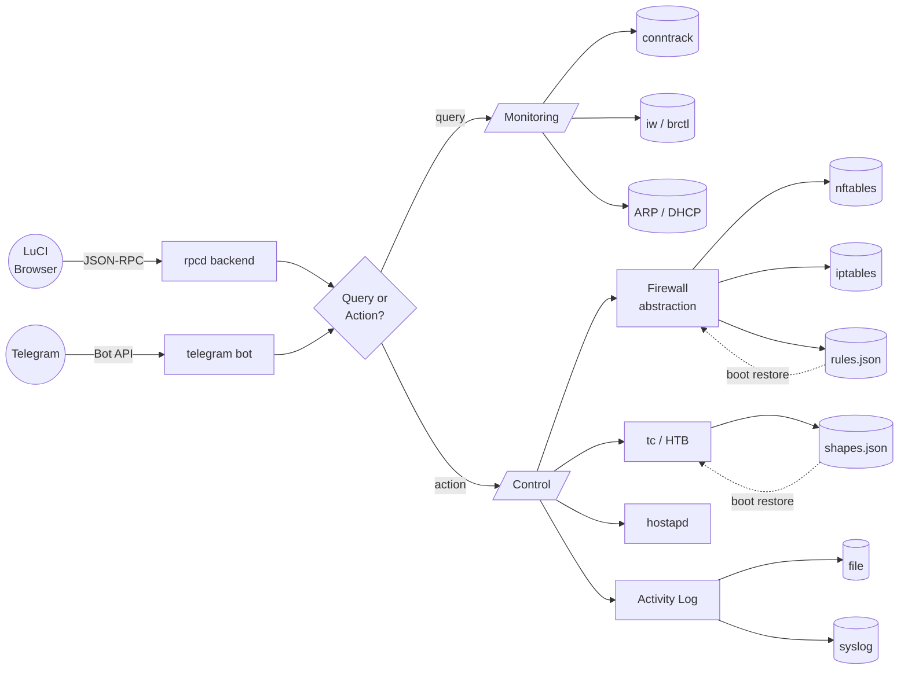

# luci-app-trafficctl

[](https://github.com/YusDyr/luci-app-trafficctl/actions/workflows/shellcheck.yml)
[](https://github.com/YusDyr/luci-app-trafficctl/actions/workflows/eslint.yml)
[](https://github.com/YusDyr/luci-app-trafficctl/actions/workflows/tests.yml)
[](https://github.com/YusDyr/luci-app-trafficctl/actions/workflows/release.yml)
[](https://github.com/YusDyr/luci-app-trafficctl/security/code-scanning)
[](https://github.com/YusDyr/luci-app-trafficctl/releases/latest)
[](LICENSE)

Per-device traffic monitoring and control for OpenWrt routers. Monitor connections, limit bandwidth, shape traffic, block internet access, and manage WiFi MAC filtering -- all from a single LuCI page.

---

I built this because I wanted a reliable one-click way to cut my kids off the internet — and found that doing it properly on OpenWrt is surprisingly awkward. Most approaches either miss already-established connections (so the device stays online until the session times out on its own), or require navigating across several LuCI pages just to get something done.

Custom shell scripts solved the immediate problem. But once I had something working, I wanted to actually *see* what was happening on the network — who was online, how much traffic each device was generating, where they were connecting to. So I added a live traffic table.

That opened the door to more: which interface is each device on? What's the TCP state breakdown? What are the top destinations? One thing led to another, and the connection detail view followed.

A hard internet block also felt heavy-handed for everyday use — sometimes slowing a device down is better than cutting it off entirely. So I added rate limiting and traffic shaping via tc/HTB, with persistence across reboots.

After that, the focus shifted to making the whole thing convenient to live with: a recent-devices bar for one-click access, live sparkline graphs with a hover popup, a searchable device picker, configurable columns, activity logging.

The latest addition is Telegram — instant notifications when a new device joins the network, and the ability to block, unblock, or throttle any device directly from my phone without opening a browser.

I hope it turns out as useful for you as it has been for me.

---

| | |
|---|---|
| **Monitoring** | Live bandwidth sparklines · TCP state breakdown · Per-connection detail · rDNS lookup |
| **Control** | Internet block · WiFi MAC deny · Rate limiter (nft policer) · Traffic shaper (tc/HTB) |
| **Visibility** | WiFi band (2.4G/5G/6G) · LAN port detection · Reachability indicator · Extended stats |
| **UX** | Searchable device picker · Column toggles · Colorblind-safe · Dark + light theme |
| **Automation** | Telegram bot · Activity logging · Boot persistence · DHCP hotplug new-device alerts |

---

## Table of Contents

- [Screenshots](#screenshots)
- [Features](#features)
- [System Requirements](#system-requirements)
- [Compatibility](#compatibility)
- [Installation](#installation)
- [Quick Start](#quick-start)
- [Configuration](#configuration)
- [Architecture](#architecture)
- [Project Layout](#project-layout)
- [Documentation](#documentation)
- [Contributing](#contributing)
- [License](#license)

---

## Screenshots

<table>
<tr>
<td align="center"><b>Dashboard — live speed graph</b></td>
<td align="center"><b>Block / Unblock Internet</b></td>
</tr>
<tr>
<td></td>
<td></td>
</tr>
<tr>
<td align="center"><b>Rate Limiting &amp; Traffic Shaping</b></td>
<td align="center"><b>Interactive speed graph popup</b></td>
</tr>
<tr>
<td></td>
<td></td>
</tr>
</table>

<details>
<summary>More screenshots — light theme, settings, Telegram, activity log…</summary>
<br/>

<table>
<tr>
<td align="center"><b>Overview — light theme</b></td>
<td align="center"><b>Per-device connections</b></td>
</tr>
<tr>
<td></td>
<td></td>
</tr>
<tr>
<td align="center"><b>WiFi blocked</b></td>
<td align="center"><b>Link / band column</b></td>
</tr>
<tr>
<td></td>
<td></td>
</tr>
<tr>
<td align="center"><b>Extended statistics (all devices)</b></td>
<td align="center"><b>Extended statistics (per device)</b></td>
</tr>
<tr>
<td></td>
<td></td>
</tr>
<tr>
<td align="center"><b>Group connections by service</b></td>
<td align="center"><b>Group connections by hostname</b></td>
</tr>
<tr>
<td></td>
<td></td>
</tr>
<tr>
<td align="center"><b>Searchable device picker</b></td>
<td align="center"><b>Unreachable device indicator</b></td>
</tr>
<tr>
<td></td>
<td></td>
</tr>
<tr>
<td align="center"><b>Settings walkthrough</b></td>
<td align="center"><b>Column toggles</b></td>
</tr>
<tr>
<td></td>
<td></td>
</tr>
<tr>
<td align="center"><b>Telegram Bot — configure &amp; toggle</b></td>
<td align="center"><b>Telegram Bot settings</b></td>
</tr>
<tr>
<td></td>
<td></td>
</tr>
<tr>
<td align="center"><b>Logging &amp; Persistence settings</b></td>
<td align="center"><b>Activity Log panel</b></td>
</tr>
<tr>
<td></td>
<td></td>
</tr>
</table>

</details>

---

## Features

- **Real-time Per-device Monitoring** -- View active connections per device with TCP/UDP counts, TCP state breakdown, destination IPs, and live bandwidth speed (sparkline graphs with rate limit overlay).
- **Interactive Speed Graphs** -- Hover any sparkline for a full-size popup graph with: download + upload dual lines, gradient area fill, min/max band, crosshair with precise values, rate limit line, nice-value Y axis (multiples of 100/500 Kbit/s). Full history from page load.
- **Traffic Shaping (Queue)** -- tc/HTB classes on the LAN bridge with fq_codel leaf qdiscs. Queues excess traffic instead of dropping, providing smoother throughput.
- **Rate Limiting (Policer)** -- nftables or iptables-based packet dropping when a device exceeds the configured rate. Instant enforcement, no queuing.
- **Internet Blocking** -- Layer 3 drop rules per device. Connections are killed immediately and counter stats are tracked.
- **WiFi MAC Filtering** -- Block any device from associating with WiFi via hostapd_cli deny ACL. Only the target client is deauthenticated -- no wifi reload, other clients stay connected. Works across all radio interfaces (2.4 GHz, 5 GHz, 6 GHz) automatically.
- **Interface Detection** -- Shows actual connection interface: WiFi band (2.4G/5G/6G) or LAN port name (lan2/lan3/lan4).
- **Live Speed Polling** -- Optional polling with configurable interval (default 2s); shows sparkline per device with spike filtering.
- **Reverse DNS** -- Optional hostname resolution for external destination IPs with in-memory cache (no repeated lookups).
- **Searchable Device Picker** -- Command palette (search by name, IP, or MAC) with recent devices quick-access bar stored in localStorage.
- **Telegram Bot** -- Optional bot for remote control: device list, block/unblock, rate limit, shape traffic, new device notifications. Runs on the router via long polling, no external server needed.
- **New Device Detection** -- Discovers new devices via three sources: ARP table, DHCP leases, Wi-Fi station list. Instant DHCP hotplug trigger for near-realtime alerts.
- **Activity Logging** -- Configurable logging of all actions (blocks, ratelimits, shapes, config changes) to a local file and/or syslog. Includes source IP, username, and trigger (LuCI/Telegram/CLI).
- **Reboot Persistence** -- Shaping, block, and rate-limit rules optionally survive reboot via hotplug restore. Configurable per UCI option `persist_rules`.

---

## System Requirements

### Hardware

|               | Minimum              | Recommended          |
|---------------|----------------------|----------------------|
| **RAM**       | 64 MB free           | 128+ MB free         |
| **Flash**     | 300 KB (package)     | 1 MB (with all deps) |
| **CPU**       | Any (MIPS/ARM/x86)   | ARM Cortex-A53+      |

### Software

| Package | Required for | Notes |
|---------|-------------|-------|
| `conntrack` | Core monitoring | Always required |
| `luci-base` | Web interface | Always required |
| `rpcd` | Backend RPC | Always required |
| `tc-full` + `kmod-sched-core` + `kmod-sched-htb` | Traffic shaping | For HTB/fq_codel queues |
| `iw-full` | Interface detection | WiFi band identification |
| `bridge-utils` | Interface detection | LAN port identification (brctl) |
| `curl` + `jsonfilter` | Telegram bot | jsonfilter is part of base OpenWrt |
| `rpcd-mod-rrdns` | Reverse DNS | Included with `rpcd`; enables rDNS in LuCI, Telegram, and CLI |

## Compatibility

[](https://github.com/YusDyr/luci-app-trafficctl/actions/workflows/compat.yml)

Runs on all architectures (no compiled code, pure shell + LuCI JavaScript).

| OpenWrt Version | Firewall | Status |
|-----------------|----------|--------|
| 25.12 (latest)  | fw4 / nftables | Fully supported |
| 24.10           | fw4 / nftables | Fully supported |
| 23.05           | fw4 / nftables | Fully supported |
| 22.03           | fw4 / nftables | Fully supported |
| 21.02           | fw3 / iptables | Supported (auto-detected) |

**CI-tested on 52 combinations** — every push is verified against real OpenWrt rootfs containers:

| | x86‑64 | x86‑generic | mips\_24kc | aarch64 | arm\_a9 | arm\_a15 | armsr | armvirt32 | i386 |
|---|:---:|:---:|:---:|:---:|:---:|:---:|:---:|:---:|:---:|
| **21.02.6** | ✓ | | | ✓ | | ✓ | | ✓ | |
| **22.03.7** | ✓ | | | ✓ | | ✓ | | ✓ | |
| **23.05.6** | ✓ | ✓ | ✓ | ✓ | ✓ | ✓ | ✓ | | ✓ |
| **24.10.1** | ✓ | ✓ | ✓ | ✓ | ✓ | ✓ | ✓ | | ✓ |
| **24.10.6** | ✓ | ✓ | ✓ | ✓ | ✓ | ✓ | ✓ | | ✓ |
| **25.12.0** | ✓ | ✓ | ✓ | ✓ | ✓ | ✓ | ✓ | | ✓ |
| **25.12.4** | ✓ | ✓ | ✓ | ✓ | ✓ | ✓ | ✓ | | ✓ |
| **snapshot** | ✓ | | ✓ | ✓ | | | ✓ | | |

Each test builds the `.ipk`, runs `opkg install --force-depends` inside the real OpenWrt rootfs container for that version/arch, then verifies all files are present and all scripts pass `ash -n` syntax check.

---

## Installation

> **Which file do I need?**
> - **Recommended**: v1.6.5+ (earlier releases are broken — missing status.css, invalid APK format)
> - OpenWrt **21.02 — 24.10** → download `.ipk` (opkg)
> - OpenWrt **25.12+** and snapshot → download `.apk` (apk)

Each release includes multiple filenames for the same package:

| Asset name | Purpose |
|-----------|---------|
| `luci-app-trafficctl.ipk` | Stable download URL (opkg) |
| `luci-app-trafficctl_all.ipk` | Same file, OpenWrt naming convention |
| `luci-app-trafficctl_X.Y.Z-1_all.ipk` | Same file, version-pinned |
| `luci-app-trafficctl.apk` | Stable download URL (apk) |
| `luci-app-trafficctl_noarch.apk` | Same file, OpenWrt naming convention |
| `luci-app-trafficctl_X.Y.Z-r1_noarch.apk` | Same file, version-pinned |

The "stable URL" links below always download from the latest release — the filename stays constant across versions.

### OpenWrt 25.12+ (.apk)

**Option A — LuCI web UI:**
1. Download [`luci-app-trafficctl.apk`](https://github.com/YusDyr/luci-app-trafficctl/releases/latest/download/luci-app-trafficctl.apk) to your computer
2. In LuCI: **System → Software → Upload Package...**
3. Select the downloaded file and click **OK**

**Option B — SSH (with signature verification):**

```sh
# Add the signing key (one-time):
wget -O /etc/apk/keys/luci-app-trafficctl.pub https://raw.githubusercontent.com/YusDyr/luci-app-trafficctl/main/keys/apk-signing.pub
# Install:
cd /tmp && wget https://github.com/YusDyr/luci-app-trafficctl/releases/latest/download/luci-app-trafficctl.apk && apk add luci-app-trafficctl.apk
# If you get "modified conffile" on upgrade, add `--force-maintainer` to override
```

**Option C — SSH (without key, quick install):**

```sh
cd /tmp && wget https://github.com/YusDyr/luci-app-trafficctl/releases/latest/download/luci-app-trafficctl.apk && apk add --allow-untrusted luci-app-trafficctl.apk
```

### OpenWrt 21.02 — 24.10 (.ipk)

**Option A — LuCI web UI:**
1. Download [`luci-app-trafficctl.ipk`](https://github.com/YusDyr/luci-app-trafficctl/releases/latest/download/luci-app-trafficctl.ipk) to your computer
2. In LuCI: **System → Software → Upload Package...**
3. Select the downloaded file and click **OK**

**Option B — SSH** (requires HTTPS support — `libustream-wolfssl` or `libustream-openssl`):

```sh
opkg install https://github.com/YusDyr/luci-app-trafficctl/releases/latest/download/luci-app-trafficctl.ipk
```

**Option C — SSH from your machine:**

```sh
ssh root@router 'opkg install https://github.com/YusDyr/luci-app-trafficctl/releases/latest/download/luci-app-trafficctl.ipk'
```

### From source (OpenWrt build system)

```sh
# Add to your feeds.conf (the package depends on luci, so make sure
# luci is also configured — it is by default in feeds.conf.default):
echo "src-git trafficctl https://github.com/YusDyr/luci-app-trafficctl.git" >> feeds.conf

# Update both feeds (luci must be updated before trafficctl is scanned):
./scripts/feeds update luci trafficctl
./scripts/feeds install -p trafficctl luci-app-trafficctl

# Enable and build:
echo 'CONFIG_PACKAGE_luci-app-trafficctl=m' >> .config
make defconfig
make package/luci-app-trafficctl/compile V=s
```

### Manual installation

Copy the `luci-app-trafficctl/root/` tree to the router's filesystem, then restart rpcd:

```sh
scp -r luci-app-trafficctl/root/* root@router:/
scp -r luci-app-trafficctl/htdocs/luci-static root@router:/www/
ssh root@router 'chmod +x /usr/local/bin/trafficctl-*.sh /usr/libexec/rpcd/luci.trafficctl && /etc/init.d/rpcd restart'
```

### Required packages

<details>
<summary>OpenWrt 25.12+ (apk)</summary>

```sh
# Core (always required)
apk add conntrack luci-base rpcd

# For traffic shaping
apk add tc-full kmod-sched-core kmod-sched-htb

# For interface detection (WiFi band + LAN port)
apk add iw-full bridge-utils

# rpcd-mod-rrdns is included with rpcd (no extra install needed)

# For Telegram bot (optional)
apk add curl
```

</details>

<details>
<summary>OpenWrt 21.02 — 24.10 (opkg)</summary>

```sh
# Core (always required)
opkg install conntrack luci-base rpcd

# For traffic shaping
opkg install tc-full kmod-sched-core kmod-sched-htb

# For interface detection (WiFi band + LAN port)
opkg install iw-full bridge-utils

# rpcd-mod-rrdns is included with rpcd (no extra install needed)

# For Telegram bot (optional)
opkg install curl
```

</details>

---

## Quick Start

1. Install the package (see above).
2. Navigate to **Status > Traffic Control** in LuCI.
3. The summary table shows all active devices with connection counts, traffic, speed limits, and connection interface.
4. Use the search bar to find a device by name, IP, or MAC.
5. Select a device to see its per-connection detail table.
6. Use the action buttons to pause internet, block WiFi, or set a speed limit.

### Telegram Bot (optional)

1. Create a bot via [@BotFather](https://t.me/BotFather) and copy the token.
2. Send any message to your bot and find your chat ID via `https://api.telegram.org/bot<TOKEN>/getUpdates`.
3. In LuCI, expand **Settings > Telegram Bot**, enter token and chat ID, click **Test**, then **Save**.
4. In Telegram, send `/devices` to see the device list with action buttons.

---

## Configuration

### Speed Limit Modes

| Mode | Mechanism | Behavior | Best For |
|------|-----------|----------|----------|
| **Shaper** | tc/HTB + fq_codel | Queues excess packets | Smooth streaming, lower jitter |
| **Limiter** | nft `limit rate` / iptables `hashlimit` | Drops excess packets | Quick enforcement, low overhead |

### Persistence

**Note**: As of v1.6.5+, the runtime data directory is `/etc/trafficctl/` (previously `/etc/trafficmon/`).

- Shaping rules are always saved to `/etc/trafficctl/shapes.json` and restored on boot.
- Block and rate-limit rules are optionally persistent when `persist_rules` is enabled in Settings > Logging & Persistence (saved to `/etc/trafficctl/rules.json`).
- On reboot, the hotplug script at `/etc/hotplug.d/iface/99-trafficctl-shapes` restores all saved rules (shapes, blocks, ratelimits) when the LAN interface comes up.

### Activity Logging

- All mutable actions are logged with timestamp, source IP, username, trigger (luci/telegram/cli), and target.
- Log file: `/tmp/trafficctl/activity.log` (volatile; survives until reboot). Path and max lines are configurable via UCI.
- Optionally duplicates to syslog (`logger -t trafficctl`) for remote log collection.
- Per-category toggles: blocks, ratelimits, shapes, telegram, config changes.

### WiFi MAC Filtering

When a device is WiFi-blocked:
- Its MAC is added to the deny list on **all** wifi-iface sections via UCI.
- `macfilter=deny` is set on each interface.
- At runtime, `hostapd_cli deny_acl ADD_MAC` adds the MAC to the deny ACL and `deauthenticate` disconnects only that client. No wifi reload -- other clients stay connected.

---

## Architecture



The frontend talks to a thin rpcd dispatcher over ubus. The Telegram bot provides parallel remote control via long polling. Backend shell scripts split into two groups: **monitoring** (read-only, pulls data from conntrack, ARP, DHCP leases, and wireless subsystems) and **control** (writes firewall rules, tc classes, or WiFi MAC filters). A firewall abstraction layer auto-detects nft vs iptables at runtime. All mutable actions are logged to a local file and optionally syslog. Rules optionally persist across reboots via hotplug scripts.

---

## Project Layout

| Path | Role |
|------|------|
| `luci-app-trafficctl/htdocs/.../view/trafficctl/status.js` | Frontend — single ES5 file, no deps |
| `luci-app-trafficctl/htdocs/.../view/trafficctl/status.css` | Frontend styles |
| `luci-app-trafficctl/root/usr/libexec/rpcd/luci.trafficctl` | rpcd backend — JSON-RPC dispatch |
| `luci-app-trafficctl/root/usr/local/bin/trafficctl-*.sh` | Backend scripts (monitoring + control) |
| `luci-app-trafficctl/root/usr/local/bin/trafficctl-fw.sh` | Firewall abstraction layer (sourced) |
| `luci-app-trafficctl/root/usr/local/bin/trafficctl-telegram.sh` | Telegram bot daemon (long polling) |
| `luci-app-trafficctl/root/etc/init.d/trafficctl-telegram` | procd init script for the bot |
| `luci-app-trafficctl/root/etc/hotplug.d/iface/99-trafficctl-shapes` | Boot persistence for tc + block + ratelimit rules |
| `luci-app-trafficctl/root/etc/hotplug.d/dhcp/99-trafficctl-newdevice` | Instant new-device detection via DHCP events |
| `luci-app-trafficctl/root/usr/share/rpcd/acl.d/` | ACL permissions |
| `Makefile` | OpenWrt package build |
| `docs/` | Extended docs (architecture, API, compat) |

---

## Documentation

| Document | Description |
|----------|-------------|
| [ARCHITECTURE.md](docs/ARCHITECTURE.md) | Component diagram, data flow sequences, tc/HTB hierarchy, security model |
| [API.md](docs/API.md) | All rpcd methods, script arguments, JSON output formats |
| [COMPATIBILITY.md](docs/COMPATIBILITY.md) | OpenWrt version matrix, nft/iptables feature parity, known limitations |
| [DEVELOPMENT.md](docs/DEVELOPMENT.md) | Dev setup, deploy commands, code style, debugging |

---

## Contributing

Contributions are welcome. Please:

1. Fork the repository and create a feature branch.
2. Test on at least one real OpenWrt device.
3. Ensure both nftables and iptables code paths work if your change touches firewall logic.
4. Keep the single-file JavaScript approach -- no bundlers, no npm, no transpilation.
5. Shell scripts must be POSIX sh compatible (BusyBox ash/dash).
6. All scripts emit JSON to stdout.

### Code Style

- **JavaScript**: ES5 syntax (LuCI compatibility), `'use strict'`, no external dependencies.
- **Shell**: POSIX `/bin/sh`, validate all IP input, output JSON only.

---

## License

Licensed under the Apache License, Version 2.0. See [LICENSE](LICENSE) for the full text.

Copyright 2024-2026 Denis Iusupov.

